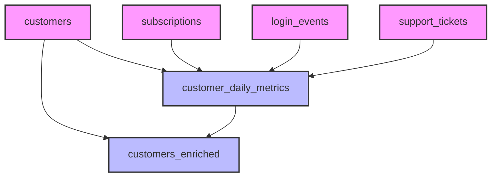

# DAG (Directed Acyclic Graph) for SaaS Data Models

This diagram shows the dependencies between models in the saas_data directory:

## Base Models (Pink)
- **customers**: Base customer information
- **subscriptions**: Customer subscription data
- **login_events**: User login activity
- **support_tickets**: Customer support tickets

## Derived Models (Blue)
- **customer_daily_metrics**: Daily metrics derived from all base models
- **customers_enriched**: Latest metrics derived from customers and customer_daily_metrics

## Dependencies
1. **customer_daily_metrics** depends on:
   - customers
   - subscriptions
   - login_events
   - support_tickets

2. **customers_enriched** depends on:
   - customers
   - customer_daily_metrics

## Materialization Types
- All models are materialized as tables
- Base models contain raw data
- Derived models contain aggregated and transformed data

## Data Flow
1. Base models provide raw data
2. customer_daily_metrics aggregates daily metrics from all sources
3. customers_enriched provides the latest snapshot of each customer

## Key Points
- The DAG shows a clear separation between base and derived models
- All paths lead to customers_enriched as the final model
- No circular dependencies exist
- The structure allows for incremental processing 