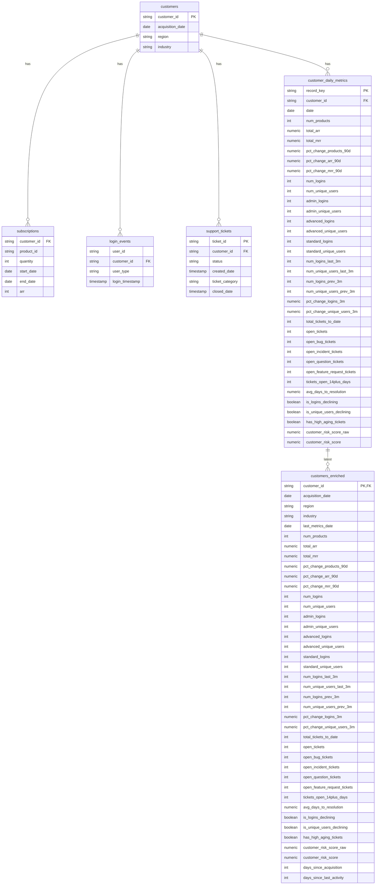

# Entity Relationship Diagram for SaaS Data Models

This diagram shows the relationships between all models in the saas_data directory:

1. **customers**: Base table containing customer information
   - Primary key: `customer_id`
   - Contains basic customer attributes (acquisition date, region, industry)

2. **subscriptions**: Customer subscription data
   - Foreign key: `customer_id` references customers
   - Contains product assignments, quantities, and revenue information

3. **login_events**: User login activity
   - Foreign key: `customer_id` references customers
   - Contains user type and login timestamp information

4. **support_tickets**: Customer support tickets
   - Primary key: `ticket_id`
   - Foreign key: `customer_id` references customers
   - Contains ticket status, category, and timing information

5. **customer_daily_metrics**: Daily metrics for each customer
   - Primary key: `record_key` (surrogate key)
   - Foreign key: `customer_id` references customers
   - Contains comprehensive daily metrics including:
     - Subscription metrics (products, ARR, MRR)
     - Login metrics (by user type)
     - Support ticket metrics
     - Risk scores

6. **customers_enriched**: Latest metrics for each customer
   - Primary key: `customer_id`
   - Foreign key: `customer_id` references customers
   - Contains the most recent metrics from customer_daily_metrics plus:
     - Days since acquisition
     - Days since last activity

## Key Relationships:
- One customer can have many subscriptions
- One customer can have many login events
- One customer can have many support tickets
- One customer can have many daily metrics
- One customer has one enriched record (latest metrics) 